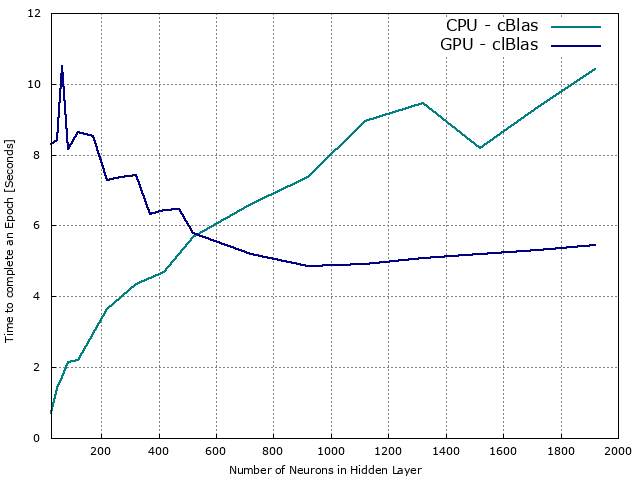

# NeuralNetwork-clBLAS

The code is a C++ implementation of a Feedforwad Neural Network with one hidden layer running on a GPU deploying OpenCL and exploting clBlas to obtain higher performance in terms of time. Its initial purposes were: 
1. classyfing digits from the MNIST dataset
2. compare the performances, in terms of time, of a neural network able to run on a GPU exploiting OpenCL and 
   clBlas against a neural network running on a CPU and exploiting cBlas.

The neural network takes as input the images of the MNIST dataset, applyes a tanh non linearity and finally classifies them deploying 
the softmax non linearity. The neural network has been trained with the cross-entropy loss and deploying the stocastic gradient descent.
Since the major purpose was to test the 
performances, we make the neural network stop training when either it reaches a 95% accuracy on the training set or 10 epochs have been 
completed. 

The results of the of the performances test can be seen in the following graph: 

